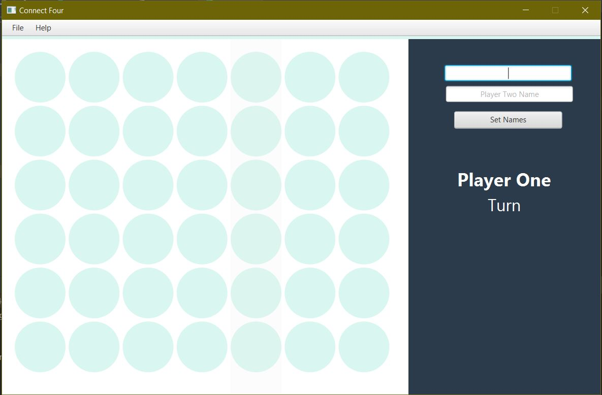
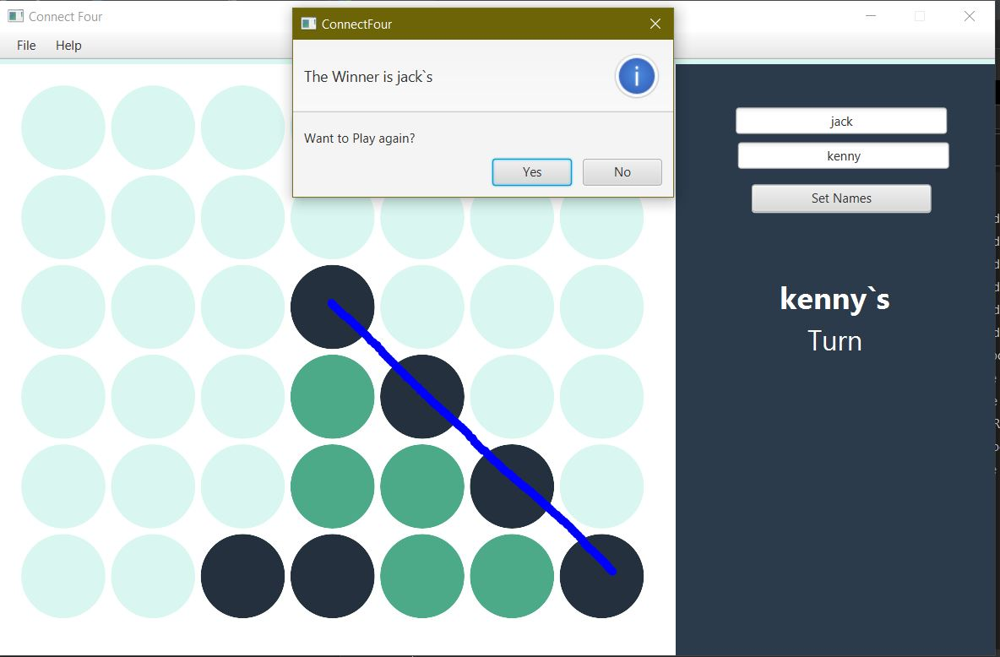
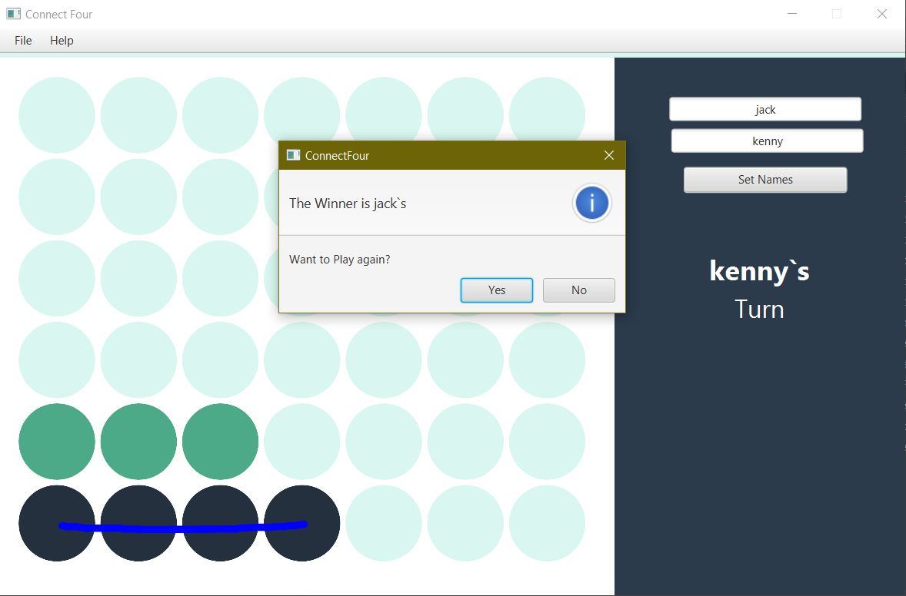
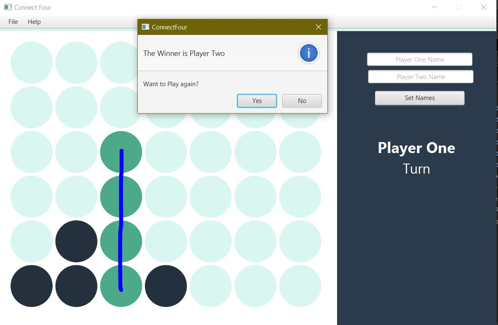

#Connect-Four App
- **About** 
  - Connect Four is a two-player connection game in which the players first choose a color and then take turns dropping colored discs from the top into a seven-column, six-row vertically suspended grid. The pieces fall straight down, occupying the next available space within the column. The objective of the game is to be the first to form a horizontal, vertical, or diagonal line of four of one's own discs. Connect Four is a solved game. The first player can always win by playing the right moves.
- I used [JavaFX](https://docs.oracle.com/javafx/2/overview/jfxpub-overview.htm) package in with the help of [Scene builder](https://gluonhq.com/products/scene-builder/) to make this simple game.
- I used the `MINMAX Algorithm` in this.
- BASIC APP PREVIEW IS LIKE THIS
  
- the game ends when there is any possible combination of 4 dots like shown below
  - diagonal dots connected
    
  - horizontal dots connected
       
  - vertical dots connected
     
- **_TODO :-_**
  - adding computer based AI in this.
  - adding to save the data of the user's win 
  - login page to the app.